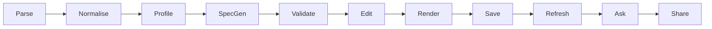

# Unsheet

> **Any spreadsheet. Instant dashboard.**

> [!IMPORTANT]
> **Headline Privacy Guarantee**: Parsing, profiling, and querying run **100% in your browser sandbox**. The server and the LLM only ever receive column metadata and a small capped sample (**maximum 5 values per column, maximum 40 characters each**), never your full dataset, unless you explicitly opt in to saving or sharing.

---

## Product Overview & Pipeline

Unsheet is a local-first, zero-friction data intelligence platform that transforms raw, messy spreadsheets (`.xlsx`, `.xls`, `.csv`, `.tsv`) into production-grade interactive dashboards in seconds. 

The core architectural innovation of Unsheet is that **the dashboard specification (`DashboardSpec` JSON) is the product**. The rendering tier is completely generic, and the LLM never writes arbitrary UI code or executes untrusted scripts; it only produces strictly validated, schema-constrained JSON specifications.

### The 10-Step Ingestion & Intelligence Pipeline



1. **Parse**: Secure file ingestion via SheetJS (pinned vendor tarball) with pre-decompression ZIP size caps, entity expansion defense, and sheet bounds limits.
2. **Normalise**: Table structure cleaning, header sanitization into `SafeIdentifier` tokens, and robust prototype pollution rejection (`__proto__`, `constructor`, `prototype`).
3. **Profile**: Automated column profiling calculating types (`string`, `number`, `boolean`, `date`), null counts, cardinality, min/max metrics, and safe capped sample values.
4. **Generate Spec (JSON)**: Deterministic heuristic generation of a rich `DashboardSpec` (layout, KPI cards, charts, tables) based on data topology.
5. **Validate**: Strict validation against authoritative Zod contracts (`@unsheet/contracts`) ensuring type safety across the entire application stack.
6. **Edit**: WYSIWYG dashboard customization allowing users to reorder widgets, change chart types, reassign axes, and tweak formatting.
7. **Render**: 12-column responsive dashboard rendering via Tailwind CSS, Lucide icons, Recharts, and accessible companion tables.
8. **Save as Template**: Persist dashboard configurations locally in IndexedDB or share them securely via Supabase templates.
9. **Refresh against New Files**: Automated schema-drift detection matching old column schemas to new uploaded spreadsheets with interactive remapping.
10. **Ask Your Data**: Natural language analytical querying powered by Vercel AI SDK and DuckDB-WASM SQL generation with strict AST validation.

---

## Core Architecture & Stack

Unsheet is built as a rigorous TypeScript monorepo managed with `pnpm` workspaces:

| Package / App | Path | Description |
|---|---|---|
| **`@unsheet/contracts`** | [`packages/contracts`](file:///home/rvr/Work/basi/UnSheet/packages/contracts) | Authoritative Zod schemas and inferred TypeScript types (single source of truth). Zero runtime dependencies. |
| **`@unsheet/engine`** | [`packages/engine`](file:///home/rvr/Work/basi/UnSheet/packages/engine) | Pure TypeScript parsing, normalization, profiling, schema-drift detection, and DuckDB-WASM query planner. Web Worker & Node compatible. |
| **`@unsheet/fixtures`** | [`packages/fixtures`](file:///home/rvr/Work/basi/UnSheet/packages/fixtures) | Canonical golden spreadsheets, synthetic workbook generators, and adversarial test vectors. |
| **`@unsheet/web`** | [`apps/web`](file:///home/rvr/Work/basi/UnSheet/apps/web) | Next.js 15 App Router, React 19, Tailwind CSS, shadcn/ui components, Recharts visualizations, and backend API routes. |

### Technology Stack
- **Framework & UI**: Next.js 15 (App Router), React 19, Tailwind CSS, Lucide Icons, Recharts.
- **Contracts**: Zod v3 schemas with strict inference (`@unsheet/contracts`).
- **Engine & Querying**: Pure TypeScript analytical engine (`@unsheet/engine`) backed by DuckDB-WASM for lightning-fast in-browser SQL queries with serialized FIFO mutex queue.
- **AI Integration**: Vercel AI SDK with OpenAI / Anthropic providers behind `CHAT_MODEL`, structured JSON output enforcement.
- **Persistence & Auth**: Supabase (Postgres, Auth, RLS deny-by-default) for templates and share links. Anonymous demo mode operates 100% locally with zero backend required.
- **Quality & Testing**: Vitest, fast-check (property-based testing), Testing Library, axe-core (accessibility), Stryker (mutation testing), ESLint security plugin, custom secret scanner, and `pnpm audit`.

---

## 12-Column Total Dashboard Renderer & Widget Registry

Unsheet features a responsive 12-column grid layout engine supporting a comprehensive registry of widgets:

- **KPI Cards**: Single metric display with optional period-over-period delta badge and sparkline trend.
- **Line Charts**: Multi-series temporal trends with interactive tooltips and custom formatting.
- **Bar Charts**: Categorical comparisons (vertical and horizontal groupings).
- **Donut Charts**: Proportional breakdown of categorical distributions.
- **Data Tables**: Paginated, sortable, searchable data grids with column type indicators.
- **Pivot Tables**: Multi-dimensional aggregate matrices.
- **WCAG AA AccessibleDataTable**: Every visual chart includes an accessible companion tabular view to ensure full compliance for screen readers and keyboard navigation.
- **Total Renderer Guarantee**: Encapsulated in `WidgetErrorBoundary`, isolating every individual widget container so that a malformed or crashing widget never brings down the dashboard.

---

## Security & Threat Model Highlights

Unsheet implements **14 Mandatory Security Mitigations** across the entire lifecycle:

1. **Zip-Bomb Defense**: Pre-decompression ZIP inspection capping raw uploads at 10 MB and uncompressed streams at 200 MB (max 100:1 compression ratio, 20 sheets, 200k rows, 200 cols).
2. **XML Entity Neutralization**: External DTD expansion and entity resolution disabled in SheetJS parser to block Billion Laughs and XXE attacks.
3. **Formula Execution Sandbox**: Formulas are never evaluated at runtime; only pre-computed cached values (`cell.v`) are ingested, neutralizing `=WEBSERVICE()` and external link attacks.
4. **Prototype Pollution Guards**: Strict `SafeIdentifier` header sanitization (`/^[a-zA-Z_][a-zA-Z0-9_]*$/`) and explicit rejection of `__proto__`, `constructor`, and `prototype`.
5. **Formula Injection Neutralization**: Export sanitization automatically prepends single quotes (`'`) to any CSV/XLSX field starting with `=`, `+`, `-`, `@`, `\t`, or `\r`.
6. **Strict XSS Defense**: Zero use of `dangerouslySetInnerHTML`, enforced by AST-level ESLint rules.
7. **Strict CSP & Headers**: `wasm-unsafe-eval`, `frame-ancestors 'none'`, `X-Content-Type-Options: nosniff`, `Strict-Transport-Security`, and restrictive `connect-src`.
8. **Zero Raw Data Egress**: LLM payloads receive column metadata and capped samples (**max 5 values per column, max 40 characters**) with formula triggers stripped.
9. **DuckDB-WASM SQL Sandbox**: In-browser Wasm execution with zero file/network access. Raw SQL is verified via an AST validator enforcing single-statement `SELECT` queries and banning DDL/DML.
10. **Client-Side Data Isolation**: Anonymous workbooks stay in volatile memory and IndexedDB; zero server persistence by default.
11. **Cryptographic Share Tokens**: 128-bit unguessable tokens (`crypto.getRandomValues`) with timing-safe 404 responses and rate limiting.
12. **Supabase RLS**: Deny-by-default Row-Level Security policies on all backend tables.
13. **API Spend Protection**: Rate limiting on AI routes and a `DISABLE_LLM=true` global kill-switch.
14. **Supply Chain Integrity**: Pinned SheetJS vendor tarball, automated secret scanning (`scripts/scan-secrets.sh`), and `pnpm audit` gating.

For the complete threat model and STRIDE breakdown, see [SECURITY.md](file:///home/rvr/Work/basi/UnSheet/SECURITY.md) and [docs/THREAT_MODEL.md](file:///home/rvr/Work/basi/UnSheet/docs/THREAT_MODEL.md).

---

## Getting Started & Local Development

### Prerequisites
- **Node.js**: `v22.0.0` or higher.
- **pnpm**: `v11.0.0` or higher (`corepack enable pnpm`).

### Quickstart

1. **Clone and Install Dependencies**:
   ```bash
   git clone https://github.com/unsheet/unsheet.git
   cd unsheet
   pnpm install
   ```

2. **Start Development Server**:
   ```bash
   pnpm dev
   ```
   Open [http://localhost:3000](http://localhost:3000) to launch Unsheet.

3. **Run Full Verification Suite**:
   ```bash
   pnpm verify
   ```
   Runs linting, strict typechecking (`tsc --noEmit`), unit & property tests (`vitest`), build verification, secret scanning, and dependency security audits.

---

## License

Unsheet is open-source software licensed under the [MIT License](file:///home/rvr/Work/basi/UnSheet/LICENSE).
