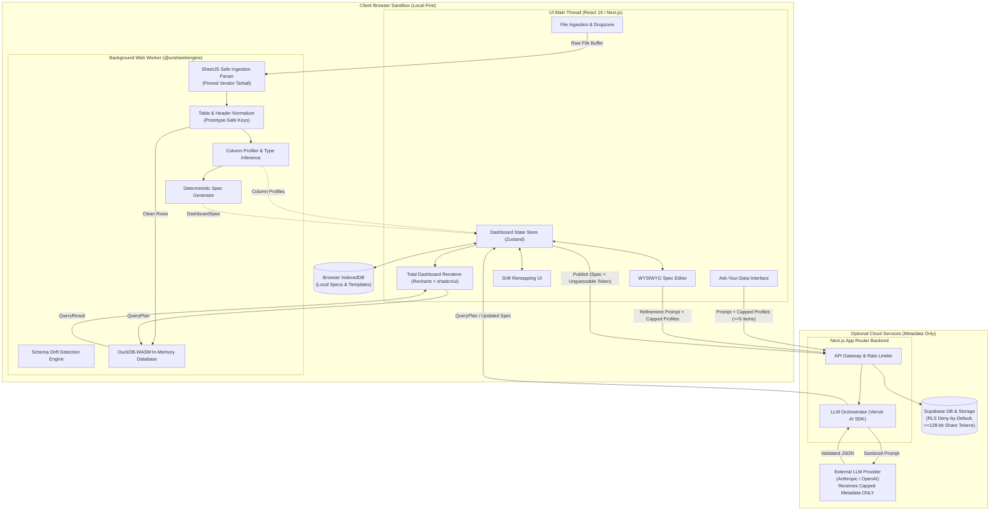
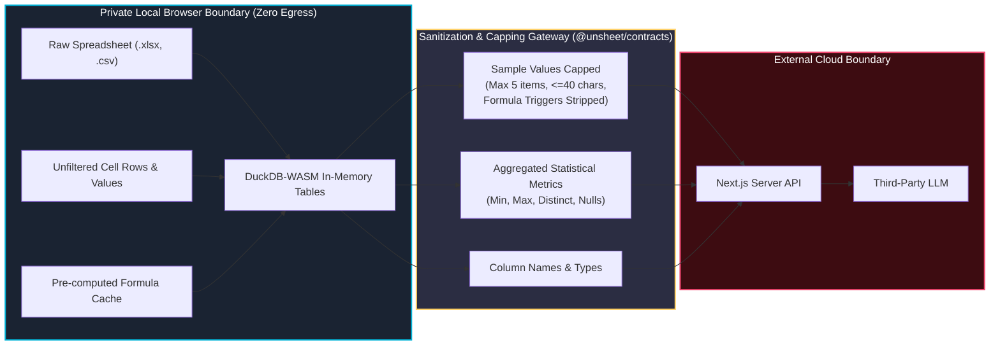
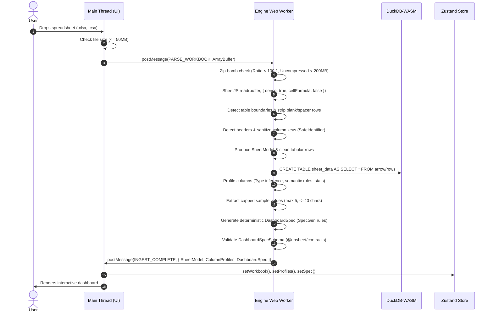
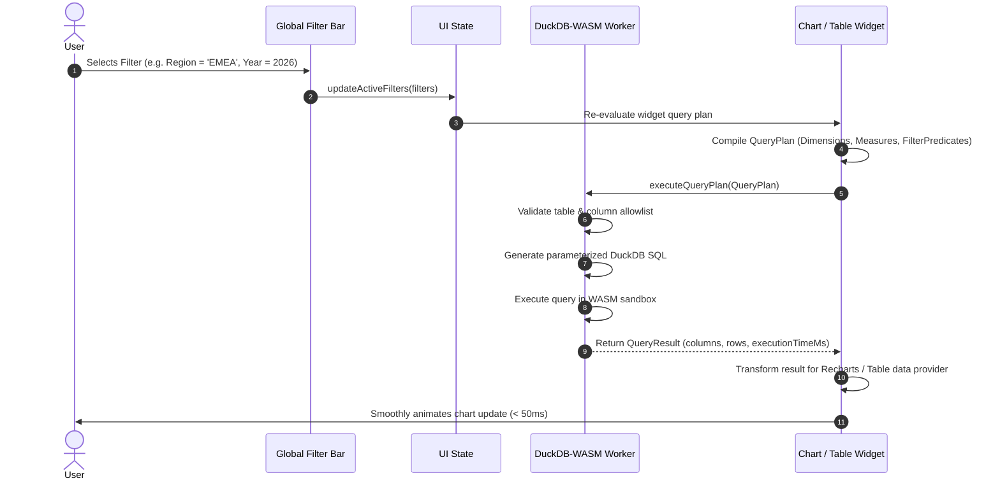
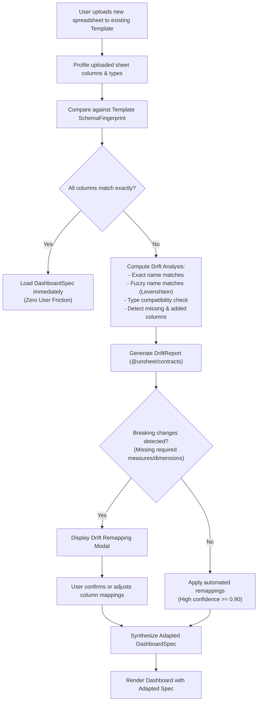
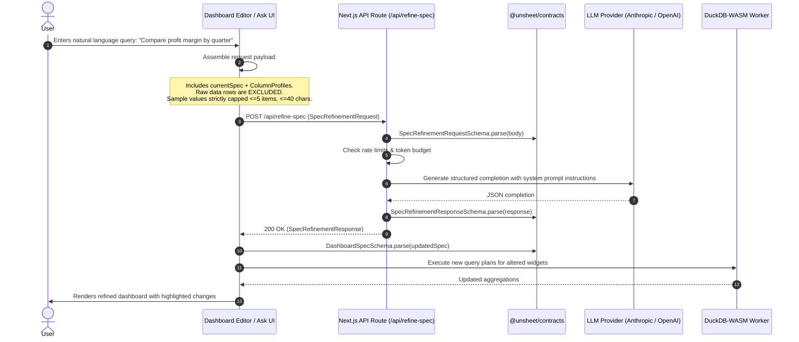
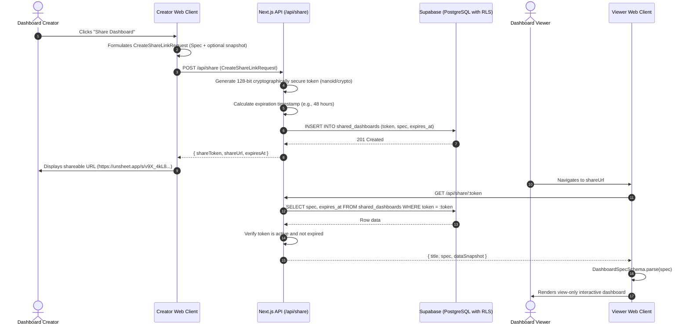

# Unsheet Architecture Specification

## 1. System Topology & Workspace Structure

Unsheet is architected as a modular TypeScript monorepo managed via `pnpm` workspaces. The architecture strictly decouples contracts, pure analytical engine logic, test fixtures, and the Next.js presentation tier.

```
Unsheet Monorepo
├── packages/
│   ├── contracts/   (@unsheet/contracts) ── Authoritative Zod schemas & TypeScript types (Zero external dependencies)
│   ├── engine/      (@unsheet/engine)    ── Pure TS parsing, normalization, profiling, DuckDB abstraction (Web Worker & Node)
│   └── fixtures/    (@unsheet/fixtures)  ── Golden workbooks, synthetic sheet generators, adversarial test vectors
└── apps/
    └── web/         (@unsheet/web)       ── Next.js 15 App Router, React 19, Tailwind CSS, shadcn/ui, Recharts
```

### Module Responsibilities & Boundary Enforcement
1. **`@unsheet/contracts`**:
   - Single source of truth for all domain entities (`WorkbookModel`, `ColumnProfile`, `DashboardSpec`, `Template`, `DriftReport`, `QueryPlan`, API payloads).
   - Zero runtime dependencies other than `zod`.
   - Strict TypeScript with `noUncheckedIndexedAccess: true`.
2. **`@unsheet/engine`**:
   - Platform-agnostic (pure TypeScript, zero DOM dependencies).
   - Executes in browser Web Workers for background data processing, or in Node.js for CLI/testing.
   - Houses the SheetJS ingestion parser, normalizer, statistical profiler, heuristic spec generator, drift engine, and DuckDB-WASM query planner.
3. **`@unsheet/fixtures`**:
   - Provides canonical golden spreadsheets (financial models, sales pipelines, messy headers, merged cells) and fuzzing generators.
4. **`@unsheet/web`**:
   - Next.js 15 App Router application providing the UI, total renderer, WYSIWYG editor, state management, and backend API routes.
   - Enforces strict Content Security Policy (CSP), zero secrets in client bundles, and AST-level XSS prevention.

---

## 2. High-Level System Architecture Diagram



---

## 3. Data Isolation Model & Privacy Boundary

Unsheet strictly separates sensitive raw data from the cloud boundary. The architecture guarantees that raw user data is processed entirely client-side.



---

## 4. Ingestion & Profiling Dataflow

The ingestion process runs inside a Web Worker to ensure 60 FPS UI responsiveness on the main thread:



---

## 5. Query Execution & Interactive Filtering Lifecycle



---

## 6. Schema Drift Detection & Template Application



---

## 7. LLM Feature Architecture (Spec Refinement & Ask-Your-Data)



---

## 8. Share Link Generation & Consumption


